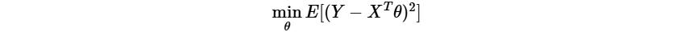
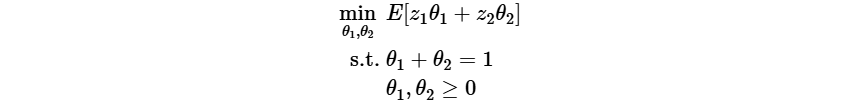

# VoteEnsemble

This repository contains the Python implementation of the VE (VoteEnsemble) family of ensemble learning methods: $\mathsf{MoVE}$, $\mathsf{ROVE}$ and $\mathsf{ROVEs}$, as proposed in the paper ''Subsampled Ensemble Can Improve Generalization Tail Exponentially'' (https://arxiv.org/pdf/2405.14741). Unlike traditional ensemble learning methods designed primarily for machine learning model training, the VE methods are applicable to a broader range of data-driven stochastic optimization problems, including both machine learning model training and stochastic programming. Moreover, they are guaranteed to provide universal exponential control over the tails of out-of-sample performance, making them particularly effective for unstable or slow-converging base learning algorithms such as those impacted by heavy-tailed noise.

Among the three methods, $\mathsf{ROVE}$ has demonstrated the best empirical performance and therefore is the most recommended choice. $\mathsf{MoVE}$ is specifically suited to problems with discrete model or solution spaces, and may outperform $\mathsf{ROVE}$ when the space has a small cardinality. $\mathsf{ROVEs}$, like $\mathsf{ROVE}$, applies to general stochastic optimization problems. While it may have lower accuracy than $\mathsf{ROVE}$ in practice, $\mathsf{ROVEs}$ is theoretically more robust.

## Installation
1.&nbsp;cd to the root directory, i.e., VoteEnsemble,  of this repository.

2.&nbsp;Install the required dependencies, `setuptools`, `numpy` and `zstandard`, if not already intalled. You can install them directly with
```
pip install setuptools numpy zstandard
```
or
```
pip install -r requirements.txt
```

3.&nbsp;Install VoteEnsemble via
```
pip install .
```
## Quick Start
To use VoteEnsemble, you need to define a base learning algorithm for you problem by subclassing the `BaseLearner` class defined in `VoteEnsemble.py`. Below are two simple use cases to illustrate this.
### Linear regression
Consider a linear regression
<!-- $$
\min_{\theta} E[(Y - X^T\theta)^2]
$$ -->



where $X$ is the input vector, $Y$ is the response variable, and $\theta$ is the model parameter vector. The script `exampleLR.py` implements such an example, where the base learning algorithm is least squares, and applies $\mathsf{ROVE}$ and $\mathsf{ROVEs}$ to learn the model parameters. Try the example by running
```
python exampleLR.py
```
which shall produce the result
```
True model parameters = [0. 1. 2. 3. 4. 5. 6. 7. 8. 9.]
ROVE outputs the parameters: [3.92431628e-03 1.01457683e+00 1.96402875e+00 3.01047031e+00
 4.00479241e+00 5.00741279e+00 5.99596621e+00 7.01602010e+00
 7.99180409e+00 8.99286178e+00]
ROVEs outputs the parameters: [-7.11339923e-03  1.00764019e+00  1.97278415e+00  3.00220791e+00
  3.99707439e+00  5.02509414e+00  5.98887793e+00  7.02417495e+00
  8.01337643e+00  8.96901555e+00]
```
### Stochastic linear program
Consider a simple linear program with random coefficients
<!-- $$
\begin{align*}
\min_{\theta_1,\theta_2}\  &E[z_1\theta_1+z_2\theta_2]\\
\text{s.t.}\ &\theta_1+\theta_2=1\\
& \theta_1,\theta_2\geq 0
\end{align*}
$$ -->



where $z_1,z_2$ are the random coefficients, and $\theta_1,\theta_2$ are the decision variables. The script `exampleLP.py` implements such as example, where the base learning algorithm is the sample average approximation, and applies $\mathsf{MoVE}$, $\mathsf{ROVE}$, and $\mathsf{ROVEs}$ to obtain solution estimates. You can try the example by running
```
python exampleLP.py
```
which shall produce the result
```
True optimal objective value = 0.0
MoVE outputs the solution: [1. 0.], objective value = 0.0
ROVE outputs the solution: [1. 0.], objective value = 0.0
ROVEs outputs the solution: [1. 0.], objective value = 0.0
```
## Advanced Tips
### Parallel Ensemble Construction and Evaluation
The VE methods involve constructing and evaluating ensembles on many random subsamples of the full dataset, which can be easily parallelized. This implementation supports parallelization through multiprocessing. By default, parallelization is disabled, but you can enable it when creating instances of each method as follows:
```
# Parallelize ensemble construction in MoVE with 8 processes
move = MoVE(yourBaseLearner, numParallelLearn=8) 

# Parallelize ensemble construction and evaluation in ROVE with 8 and 6 processes respectively
rove = ROVE(yourBaseLearner, False, numParallelLearn=8, numParallelEval=6)

# Parallelize ensemble construction and evaluation in ROVEs with 8 and 6 processes respectively
roves = ROVE(yourBaseLearner, True, numParallelLearn=8, numParallelEval=6)
```
### Offloading Ensembles to Disk
If your machine learning model or optimization solution is memory-intensive, it may not be feasible to store the entire ensemble in RAM. This implementation provides a feature to dynamically offload learned models/solutions to disk, keeping only the active model/solution in RAM. By default, this feature is disabled, but you can enable it as follows:
```
# Offload the ensemble in MoVE to the specified directory
move = MoVE(yourBaseLearner, subsampleResultsDir="path/to/your/directory") 

# Offload the ensemble in ROVE to the specified directory
rove = ROVE(yourBaseLearner, False, subsampleResultsDir="path/to/your/directory")

# Offload the ensemble in ROVEs to the specified directory and retain it after execution
roves = ROVE(yourBaseLearner, True, subsampleResultsDir="path/to/your/directory", deleteSubsampleResults=False)
```